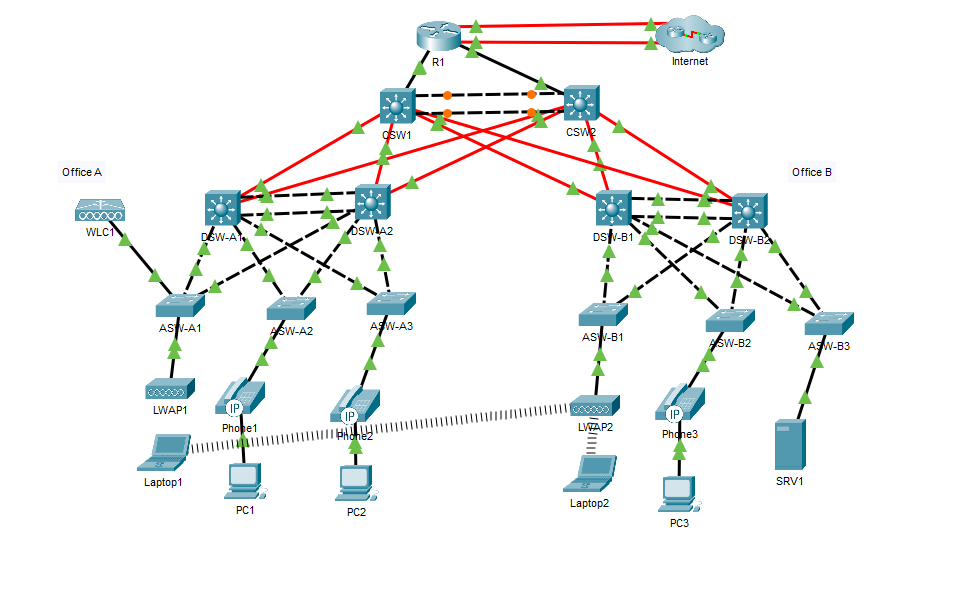

# Enterprise Two-Site Network — CCNA Mega Lab

Full two-office enterprise network covering VLANs, EtherChannels, OSPF, HSRP, DHCP, NAT/PAT, Layer-2 security, IPv6 dual-stack, and wireless — built in Cisco Packet Tracer following the [Jeremy's IT Lab CCNA Mega Lab](https://www.jeremysitlab.com/) curriculum.

---

## Architecture Overview

| Layer | Components | Role |
|-------|-----------|------|
| **Core** | CSW1, CSW2 | L3 EtherChannel interconnect, OSPF backbone, inter-site routing |
| **Distribution** | DSW-A1/A2, DSW-B1/B2 | HSRPv2 gateways, DHCP relay, STP root bridges, trunk aggregation |
| **Access** | ASW-A1/A2, ASW-B1/B2 | Host connectivity, port security, DHCP snooping, DAI |
| **Edge** | R1 | Dual ISP uplinks, NAT/PAT, OSPF ASBR, NTP stratum-5 source |
| **Services** | SRV1, WLC1 | DNS, FTP, Syslog, SNMP trap receiver, wireless controller |

## Addressing and VLAN Scheme

| VLAN | Purpose | Office A | Office B |
|------|---------|----------|----------|
| 10 | PCs | Yes | Yes |
| 20 | IP Phones | Yes | Yes |
| 30 | Servers | — | Yes |
| 40 | Wi-Fi | Yes | — |
| 99 | Management | Yes | Yes |
| 1000 | Native (unused) | Yes | Yes |

- Point-to-point links use /30 subnets; loopbacks use /32
- SRV1: 10.5.0.4/24
- WLC1 management: 10.0.0.7
- NAT pool: 203.0.113.200–207/29 (RFC 5737 TEST-NET-3)
- Static NAT: SRV1 mapped to 203.0.113.113
- IPv6: 2001:db8::/32 documentation prefix with EUI-64 on R1–CSW links

---

## Switching

**EtherChannels** — L2 bundles between distribution pairs: PAgP in Office A, LACP in Office B. L3 PortChannel1 between CSW1/CSW2 with /30 addressing.

**Trunking** — All inter-switch links run 802.1Q with DTP disabled and native VLAN 1000. Per-office VLAN pruning applied.

**VTP** — Version 2, domain *JeremysITLab*. Distribution switches as servers, access switches as clients.

**Spanning Tree** — Rapid PVST+ with root bridges aligned to HSRP active gateways. PortFast and BPDU Guard on all host-facing ports.

## Routing

**OSPF** — Single-area (Area 0) on all L3 interfaces. Router IDs set to loopback addresses. SVIs and loopbacks configured as passive. Physical inter-switch links set to non-broadcast network type to suppress DR/BDR elections.

**Default Routes** — Dual recursive defaults toward ISP via R1. G0/1/0 path configured as floating static (higher AD). Default route redistributed into OSPF (R1 as ASBR).

**IPv6** — Dual-stack enabled on R1, CSW1, CSW2. Two default IPv6 routes with floating backup. Link-local addressing on PortChannel1.

## First-Hop Redundancy

**HSRPv2** — Multiple groups per office, one per VLAN subnet. Active/standby split across distribution pairs for load distribution:

| Office | DSW-x1 Active | DSW-x2 Active |
|--------|--------------|--------------|
| A | Management, PCs | Phones, Wi-Fi |
| B | Management, PCs | Phones, Servers |

Preemption enabled on all groups.

## Network Services

| Service | Implementation |
|---------|---------------|
| **DHCP** | Pools on R1 per subnet, first 10 addresses excluded. Distribution switches relay via `ip helper-address`. |
| **DNS** | A and CNAME records on SRV1 for internal and simulated external hosts. |
| **NTP** | R1 as stratum-5 source with MD5 authentication. All devices sync to R1 loopback. |
| **SNMP** | Read-only community configured; traps sent to SRV1. |
| **Syslog** | All severity levels forwarded to SRV1. Local buffer set to 8192 bytes. |
| **FTP** | IOS image transfer from SRV1 to R1. |
| **NAT/PAT** | Static mapping for SRV1; dynamic PAT for user subnets via named pool. |

## Security

| Control | Scope | Detail |
|---------|-------|--------|
| **Extended ACLs** | Inter-office traffic | ICMP permitted between Office A/B PC subnets; all other cross-office traffic denied |
| **SSH** | Management plane | SSHv2 only on VTY lines, RSA 2048-bit keys, ACL restricting source to Office A PCs |
| **Port Security** | SRV1 (F0/1) | Single MAC, sticky learning, restrict violation mode |
| **DHCP Snooping** | All VLANs | Uplinks trusted, untrusted ports rate-limited (15 pps; 100 pps on WLC link) |
| **DAI** | All VLANs | Trusted uplinks, full ARP validation (src-mac, dst-mac, IP) |
| **BPDU Guard** | All host ports | Automatic err-disable on unexpected BPDU |
| **Unused Ports** | All switches | Administratively shut down |

## Wireless

- WLC1 with dynamic interface on VLAN 40 (Wi-Fi subnet)
- WLAN ID 1 configured with WPA2-AES PSK
- Both LWAPs verified joined to WLC1

## Discovery

CDP disabled globally. LLDP enabled on all devices with transmit disabled on host-facing port F0/1 to prevent endpoint enumeration.
